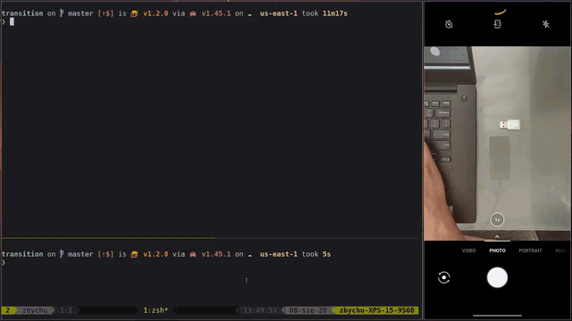

<div align="center">

  <h1><code>transition</code></h1>

  <h3>
    <strong>LED notification made easy</strong>
  </h3>

  <p>
    
    <a href="https://crates.io/crates/transition">
      
    </a>
    <a href="https://codecov.io/gh/devzbysiu/transition">
      
    </a>
    <a href="https://crates.io/crates/transition">
      
    </a>
    <a href="https://docs.rs/transition">
      
    </a>
  </p>

  <h3>
    <a href="#about">About</a>
    <span> | </span>
    <a href="#demo">Demo</a>
    <span> | </span>
    <a href="#installation">Installation</a>
    <span> | </span>
    <a href="#license">License</a>
    <span> | </span>
    <a href="#contribution">Contribution</a>
  </h3>

  <sub><h4>Built with 🦀</h4></sub>
</div>

# <p id="about">About</p>

This library allows you control the state of code execution using <a href="https://blink1.thingm.com/">blink(1)</a> LED notifier.

You simply wrap the code you want to track with transition library:
```rust
use std::error::Error;
use std::thread;
use std::time::Duration;
use transition::Transition;

fn main() -> Result<(), Box<dyn Error>> {
    // start notification
    let notification = Transition::default().start()?;

    // our example code
    thread::sleep(Duration::from_secs(5));

    // task finished with success
    notification.notify_success()?;

    Ok(())
}
```

#### What does it do?
1. After calling `start()`, blink(1) starts blinking with blue light. This is done in a separate
   thread.
2. Then our code is executing.
3. At the end we call `notification.notify_success()` (or `notification.notify_failure()`) which
   changes the color of LED to green (or red).

Supported colors:
```rust
use transition::Led;

let color = Led::Blue;
match color {
  Led::Red => println!("red"),
  Led::Green => println!("green"),
  Led::Blue => println!("blue"),
  Led::Yellow => println!("yellow"),
  Led::Orange => println!("orange"),
  Led::Pink => println!("pink"),
  Led::Cyan => println!("cyan"),
  Led::White => println!("white"),
  Led::Blank => println!("turn off the led"),
}

```

#### See <a href="https://github.com/devzbysiu/transition/tree/master/examples">examples</a> for more

# <p id="demo">Demo</p>

<center>

  

</center>

# <p id="installation">Installation</p>

Add as a dependency to your `Cargo.toml`:
```toml
[dependencies]
transition = "0.1.0"
```

**Make sure that you have correct access rights to access blink(1) device. See udev rules [here](https://github.com/todbot/blink1/blob/master/linux/51-blink1.rules).**

# <p id="license">License</p>

This project is licensed under either of

- Apache License, Version 2.0, (LICENSE-APACHE or http://www.apache.org/licenses/LICENSE-2.0)
- MIT license (LICENSE-MIT or http://opensource.org/licenses/MIT)

at your option.

# <p id="contribution">Contribution</p>

Unless you explicitly state otherwise, any contribution intentionally submitted for inclusion in the work by you, as defined in the Apache-2.0 license, shall be dual licensed as above, without any additional terms or conditions.

